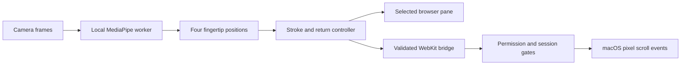

<p>
  
</p>

# Moves

**Scroll with your fingers. Keep your attention on what you’re reading.**

Moves is an experimental camera-based scrolling tool for reading code, diffs,
conversations, and long pages. A small macOS menu-bar app tracks four fingertips
and sends ordinary scroll events to the pane under your pointer. No special
hardware, cloud inference, or account is required to use it.

The project also includes a browser reading lab for trying the gesture controller
without granting system-control permission. Moves is independently built

> **Status:** source prototype, tested locally on an Apple Silicon Mac running
> macOS 27. It is not a notarized, ready-to-install release. Other Macs, macOS
> versions, and physical hand movements need further testing.

## What it does

- **Four-fingertip scrolling:** move your index, middle, ring, and little fingers
  together. No exact straight-finger pose or pinch is required. The controller
  tolerates one unusable fingertip; the camera still needs to recognize your hand.
- **Repeated strokes:** scroll, return to your starting position, and repeat.
  The return does not undo your progress.
- **Automatic direction changes:** pause for half a second, then move the other
  way. No direction button is needed in the native app.
- **A visible camera:** a compact 264-point-wide floating panel keeps the full
  rectangular feed, fingertip dots, status, and Start/Stop controls visible.
- **Optional sideways movement:** disabled by default in the native app; enable
  it in the Moves menu. Both axes can move together when enabled.
- **Local processing:** camera frames go to a local MediaPipe worker. Moves has
  no recording, upload, analytics, speech processing, or microphone feature.

## How to scroll

1. Open Moves. It starts with the camera and scrolling **off**.
2. Put your pointer over the pane you want to read.
3. Press **Control–Option–M**, click **Start scrolling**, or use the menu-bar
   toggle. On first use, approve Camera and scroll-control access.
4. Bring one hand into view. Use the four fingertip dots as feedback.
5. Move your fingertips upward: the content moves upward, revealing later lines.
   Return downward and repeat; that return is ignored.
6. To reverse, finish returning, hold still for **½ second** until the panel says
   **Choose direction**, then make a downward stroke. Content moves downward,
   revealing earlier lines; upward returns are now ignored.

Holding still stops movement immediately. The half-second pause also rearms
selection, including if you pause halfway through a stroke. Finish the return
before pausing when you want to keep repeating the same stroke.

**Stop:** press Control–Option–M again, press **Escape** while enabled, click Stop,
or close the panel. Closing the panel leaves the menu-bar app running. Quitting
Moves removes its shortcut; the shortcut does not launch an app that is closed.
Sleep, screen lock, tracker failure, and lost output permission stop the session.
Tracking loss rebases the controller without jumping on reacquisition.

The camera tracks movement, not intent. Direction locking and the pause rule are
how this prototype distinguishes a scrolling stroke from its return.

## Try the browser lab

Requirements: Node.js **22.12+** (tested with 26.3.0), npm, and a modern
browser with camera access. Native builds also require macOS and Xcode Command
Line Tools (`xcode-select --install`).

```sh
# From the cloned repository:
npm ci
npm run assets
npm run dev -- --port 5173 --strictPort
```

Open **http://127.0.0.1:5173/**. Select Conversation or Code diff, then click
**Start camera**. The lab scrolls only its own selected pane; it cannot scroll
Codex or other desktop apps.

`npm run assets` downloads Google's version-1 hand model over HTTPS, verifies its
pinned SHA-256, and copies the installed MediaPipe WASM runtime into `public/`.
Dependency and asset setup need the internet. Inference uses local assets after
setup. Generated models, WASM, dependencies, and application bundles are excluded
from Git.

The lab deliberately differs from the native app:

| Behavior | macOS companion | Browser lab |
| --- | --- | --- |
| Scroll target | Pane under the pointer in the receiving app | Selected lab pane |
| Vertical direction | First stroke; pause ½ second to switch | Upward/Downward selector |
| Sideways scrolling | Explicit menu opt-in; off on launch | Available when selected content actually overflows |
| System-control permission | Required | Not used |
| Shortcut | Global while Moves is running | In-page controls; Escape pauses |

## Build the macOS companion

Set up a **stable local signing identity** using [native/SIGNING.md](native/SIGNING.md).
Regular builds require it so updating the app can retain its macOS permissions.
Do not commit or share the certificate's private key.

```sh
npm ci
npm run assets
npm run check:native-signing
npm run build:native
open /private/tmp/moves-native/Moves.app
```

The build targets macOS 14 and the build machine's architecture; macOS 14 runtime
compatibility and Intel hardware are not verified. It is not a universal binary.
The generated app bundles its UI, worker, WASM, model, and third-party notices;
Node and Vite are not needed while the built app runs.
It includes the monochrome Moves logo in its app icon, menu bar, and panel header.
Moves runs as a menu-bar app, so it does not keep a normal Dock icon.

The staging copy is temporary. For a persistent installation, quit Moves, copy
`/private/tmp/moves-native/Moves.app` to `~/Applications/Moves.app` in Finder, and
open that installed copy. Grant permissions to that copy. Keep using the same
signing certificate and install location for updates.

`npm run build:native:adhoc` is available for temporary developer experiments.
Its identity changes across builds and can invalidate saved permissions; use
stable signing for your installed app. Local signing is **not** Apple Developer
ID signing or notarization. No downloadable app binary is provided here.

### Permissions and troubleshooting

- **Camera:** System Settings → Privacy & Security → Camera → Moves. Start a
  session first so macOS can request access. Microphone permission is not needed.
- **Scroll control:** allow Moves in Accessibility, or **Device Control and Data
  Access** where that is the label used by your macOS version. The app checks
  macOS event-posting access before enabling output. Full Disk Access and Screen
  Recording are not needed.
- **Shortcut does nothing:** open the app first and check for Moves in the menu
  bar. Use the menu or panel button if another application owns the shortcut.
- **Camera allowed but output denied:** verify the installed copy has control
  permission. A switch for an older ad-hoc build can be stale. Remove only that
  old Moves entry, add your current installed copy, then start again. Keep the
  stable signing identity for subsequent updates.
- **No dots or intermittent tracking:** keep one hand in view with adequate light.
  Severe occlusion, blur, turning the hand away, or showing two hands can stop
  recognition. The controller does not eliminate the model's limitations.
- **Wrong pane moves:** place the pointer over the intended scrollable region.
  The receiving app decides how to route ordinary scroll events and clamp bounds.
- **Sideways movement is unwanted:** leave it disabled in the Moves menu. The
  native app cannot inspect arbitrary apps' content overflow.

## How it works



The controller measures median displacement of corresponding fingertips
(landmarks 8, 12, 16, and 20), rather than demanding identical finger heights or a
specific palm angle. Small movement accumulates through a deadband. Vertical
returns update the reference while producing zero output. Direction changes
require a stable half-second pause; gradual motion does not count as a pause.

X and Y have independent references and can move together. Output is capped at
40 pixels per axis per update, with no trailing inertia or queued excess motion.
Tracking gaps over 500 ms, discontinuities, configuration changes, and target
changes rebase. Confident handedness is a continuity hint, not biometric identity.

| Source | Responsibility |
| --- | --- |
| `src/gesture.ts` | Fingertip consensus, direction selection, return suppression, axes and resets |
| `src/tracker.worker.ts` | MediaPipe Hand Landmarker CPU inference with one frame in flight per caller |
| `src/main.ts` | Browser lab, selected-pane scrolling, overflow detection and camera lifecycle |
| `src/native.ts` | Camera preview, worker lifecycle and session-bound native messages |
| `native/main.swift` | Floating panel, menu, shortcut, permissions and native bridge |
| `native/ScrollOutput.swift` | Bounded pixel events and fractional-pixel accumulation |
| `native/LoopbackServer.swift` | Loopback-only static assets and HTTP restrictions |
| `scripts/` | Asset integrity, worker bundling, builds and integration checks |

## Privacy and security

At runtime the native app serves bundled static assets on **127.0.0.1 at an
OS-assigned port**. It does not listen on the LAN. It restricts methods, Host,
Origin, file paths, and WebKit navigation. The native bridge accepts only the
local main frame; scroll output additionally requires an enabled, current
session, tracking, permission, and an eligible target. The app does not accept
remote control commands.

The source contains no video/landmark persistence or upload implementation.
This describes Moves itself, not the behavior of the OS, browser, or unrelated
software. A compromised local account or modified bundle is outside the current
threat model. This prototype has not received an independent security audit.

See [SECURITY.md](SECURITY.md) for boundaries and reporting, and
[VERIFICATION.md](VERIFICATION.md) for dated checks and remaining uncertainties.

## Development and checks

```sh
npm test
npm run build
npm audit

# With the dev server on 127.0.0.1:5173 and Google Chrome installed:
npm run test:browser
npm run test:native-browser

# macOS, after a stable-signed native build:
npm run test:native-signing
/private/tmp/moves-native/Moves.app/Contents/MacOS/Moves --self-test
/private/tmp/moves-native/Moves.app/Contents/MacOS/Moves --check-webkit
```

Browser integration checks use artificial video and simulated landmarks. Native
self-tests construct events but **do not post them**, and `--check-webkit` runs
inference on a blank image without camera access. These checks prove defined
software behavior; they do not measure real hand comfort or universal app support.

For a physical trial, read a long page for ten minutes: repeat ten strokes in
each direction, switch with the pause, lose/reacquire the hand, stop, and return
to typing. Check that returns do not undo progress and nothing scrolls after Stop.
When sideways scrolling is enabled, try diagonal motion over genuinely long lines.

## Limits and direction

Recognition varies with light, angle, hand visibility, background, and camera
placement. Two hands are rejected to avoid selecting an unintended hand. Two
erratic fingertips can defeat the controller's consensus; unintended ordinary
hand motion can still scroll while a session is active. The shown processing time
excludes sensor exposure, buffering, and display delay; it is not total latency.

The current scope is scrolling. Pointer movement, clicks, custom gestures,
voice integration, sonar/radar sensing, cross-platform desktop control, and
notarized distribution are not implemented. Further work should prioritize
physical trials, comfortable camera placement, and dependable start/stop behavior.

## License and acknowledgments

Moves source is provided under the [MIT license](LICENSE). MediaPipe software,
WASM, and the upstream hand-tracking model retain their own licenses; see
[THIRD_PARTY_NOTICES.md](THIRD_PARTY_NOTICES.md). MediaPipe supplies landmark
recognition; Moves supplies the scrolling controller and app integration.
